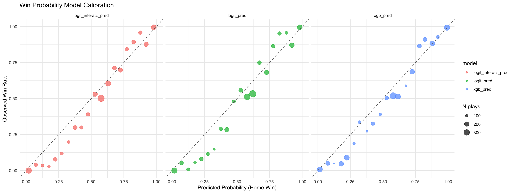

# Baseball Win Probability Model

An in-game win probability model for MLB games. Given a live game state (inning, outs, baserunners, score), it predicts the probability the home team wins. Built as a way to practice applied predictive modeling on a domain I actually enjoy.

## Data

Pulled directly from the MLB Stats API via [`baseballr`](https://billpetti.github.io/baseballr/), no scraping, no auth required. Currently trained on one month of pitch-level play-by-play data (April 2025 regular season), filtered down to one row per plate appearance.

## Approach

**Features:** inning, top/bottom of inning, outs, score differential, and baserunner state (8 possible combinations of runners on 1st/2nd/3rd).

**Models compared:**
1. **Logistic regression (baseline)**: `home_win ~ inning + is_top + outs + score_diff + base_state`
2. **Logistic regression + interaction**: adds an `is_top × base_state` interaction term, based on the intuition that baserunner state means something different depending on which team is batting
3. **XGBoost**: gradient-boosted trees, which can find interactions like the one above automatically, without specifying them by hand

**Validation:** train/test split at the *game* level (not row level), since rows within a game are highly correlated; a random row split would leak information. Evaluated on both log-loss and calibration (does a 70%-predicted game actually get won about 70% of the time?), not just accuracy.

## Key findings

- `score_diff` is by far the strongest predictor. Each additional run of home-team lead roughly doubles the odds of a home win, holding everything else constant.
- Baserunner state alone wasn't a statistically significant predictor of final game outcome in the baseline model, but adding an interaction with `is_top` improved model fit (AIC: 13341 to 13297) and held up on out-of-sample log-loss, confirming that baserunner state matters differently depending on which team is batting.
- XGBoost outperformed both logistic regression variants on log-loss, consistent with it capturing this kind of interaction (and others) automatically.

| Model | Test log-loss |
|---|---|
| Logistic regression (baseline) | 0.4404 |
| Logistic regression (+ interaction) | 0.4375 |
| XGBoost | 0.4348 |

All three models are well-calibrated across the full probability range, with some localized differences between models in the 0.55 to 0.70 predicted-probability band.

## Next steps

- Scale up to a full season (or multiple seasons)
- Add pitcher/batter quality and ballpark features
- Build a live win-probability chart for a single game
- Benchmark against FanGraphs' published win probabilities as an external sanity check

## Tools

R, tidymodels, XGBoost, baseballr
